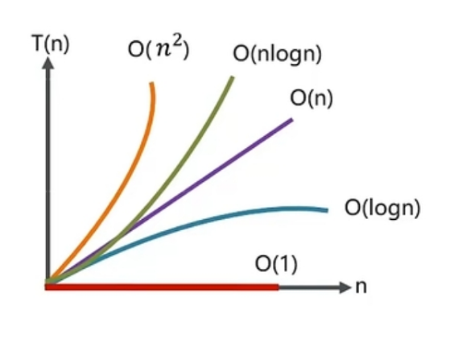

# 集合

## 集合框架
### 单例集合
* `java.util.Collections`类提供了一系列静态方法，可以返回一个只包含指定对象的不可变集合。
* List 有序，可重复
    * Vector 线程安全 数组
    * ArrayList  线程不安全 数组
    * LinkedList 线程不安全 双向链表 
* Set 无序，不可重复
    * HashSet 哈希表结构 -- LinkedHashSet 哈希表和链表结构
    * TreeSet 红黑树结构
  
### 双列集合
* Map 键值对
    * HashMap 哈希表结构 -- LinkedHashMap 哈希表和链表结构
    * TreeMap 红黑树结构
    * HashTable 线程安全 哈希表结构 -- properties
    * ConcurrentHashMap 线程安全 哈希表结构

## 时间复杂度
::: tip 时间复杂度
评估代码的执行耗时
:::
* 大O表示法 表示代码执行时间随数据规模增长的变化趋势
    * O(1) 常数时间
    * O(logN) 对数时间
    * O(N) 线性时间
    * O(NlogN) 线性对数时间
    * O(N^2) 平方时间
    * O(N^3) 立方时间
    * O(2^N) 指数时间
    * O(N!) 阶乘时间
性能从好到坏排序：O(1) < O(logN) < O(N) < O(NlogN) < O(N^2) < O(N^3) < O(2^N) < O(N!)
* 常对幂指阶


## 空间复杂度
::: tip 空间复杂度
评估代码的内存消耗
:::
* 空间复杂度是对一个算法在运行过程中临时占用存储空间大小的量度
* 常见的空间复杂度
    * O(1) 常数空间
    * O(N) 线性空间
    * O(N^2) 平方空间

## 数组
::: tip 数组
数组是一种用**连续**的内存空间存储**相同类型数据**的结构
:::
* 数组里面存的是**引用**，引用指向对象，即栈指向堆

### 数组如何获取其他元素的地址？
* 数组元素的地址 = 首地址 + 下标 * 元素大小

### 为什么数组索引从0开始？
* 在数组根据索引查找元素时，计算地址的公式为：数组首地址 + 索引 * 元素大小
* 如果索引从1开始，计算地址的公式为：数组首地址 + (索引-1) * 元素大小
* 需要增加一次减法运算，对于cpu来说，多了一次指令，效率降低

### 数组的时间复杂度
1. 根据索引 O（1）
2. 不排序查找元素 O（n） 排序后O（logn）
3. 删除/插入 最好O（1），最坏O（n）

## ArrayList
::: tip ArrayList
数组实现，查询快，增删慢
:::
* 默认的初始化容量是0，如果不指定容量，会在第一次添加元素时进行扩容，扩容到默认容量10
* 扩容机制：新容量 = 旧容量 + 旧容量 >> 1 （即1.5倍）
* 扩容时，会将原数组的元素复制到新数组中
* 删除元素时，会将删除元素后面的元素向前移动一位
* 插入元素时，会将插入位置后面的元素向后移动一位
* ArrayList是线程不安全的，适合在单线程中使用

```java
ArrayList<String> list = new ArrayList<>(10);
指定了容量为10，未扩容
```
### 如何实现数组和List的转换？
1. 数组转List
```java
String[] arr = {"a", "b", "c"};
List<String> list = Arrays.asList(arr);
```
2. List转数组
```java
List<String> list = new ArrayList<>();
String[] arr = list.toArray(new String[0]);
```
* Arrays.asList 修改了数组，list会随之改变
* list.toArray() 修改了list，数组不会改变

## 单向链表
::: tip 单向链表
链表是一种物理存储单元上非连续、非顺序的存储结构，数据元素的逻辑顺序是通过链表的指针地址实现的
:::
* 链表的每个节点包含两个部分：数据域和指针域
* 数据域用来存储数据，指针域用来指向下一个节点的位置

### 单向链表的时间复杂度
1. 查询头结点 O（1） 查询尾结点O（n） 查询中间结点O（n） 
2. 插入/删除头结点 O（1） 插入/删除尾结点O（n） 插入/删除中间结点O（n）

## 双向链表
::: tip 双向链表
双向链表是在单向链表的基础上，每个节点增加一个指向前一个节点的指针
:::
* 双向链表的每个节点包含三个部分：数据域、指向前一个节点的指针域和指向后一个节点的指针域

### 双向链表的时间复杂度  
1. 查询头结点 O（1） 查询尾结点O（1） 查询中间结点O（n）
2. 插入/删除头结点 O（1） 插入/删除尾结点O（1） 插入/删除中间结点O（n）

## ArrayList和LinkedList的区别
### 底层实现
* ArrayList是基于数组实现的，查询快，增删慢
* LinkedList是基于双向链表实现的，查询慢，增删快
### 操作效率
* ArrayList查询效率高，增删效率低
* LinkedList查询效率低，增删效率高
### 线程安全
* ArrayList是线程不安全的
* LinkedList是线程不安全的
### 内存占用
* ArrayList底层是数组，内存连续，节省内存
* LinkedList底层是链表，内存不连续，占用内存大，多两个指针

* 保证线程安全
```java
List<String> list = Collections.synchronizedList(new ArrayList<>());
List<String> list = Collections.synchronizedList(new LinkedList<>());
```
## 二叉树
::: tip 二叉树
每个节点最多有两个子节点的树结构
:::
* 满二叉树：每个节点都有两个子节点
* 完全二叉树：除了最后一层，其他层都是满的，最后一层的节点都靠左排列
* 二叉搜索树：左子树上所有节点的值均小于根节点的值，右子树上所有节点的值均大于根节点的值
* 平衡二叉树：左右子树的高度差不超过1

## 红黑树
::: tip 红黑树
红黑树是一种自平衡二叉查找树，是一种近似平衡的二叉树
:::
1. 每个节点要么是红色，要么是黑色
2. 根节点是黑色
3. 叶子节点都说黑色的空节点（NIL节点）
4. 红黑树中红色节点的子节点都是黑色
5. 从任一节点到其每个叶子的所有路径都包含相同数目的黑色节点
### 时间复杂度
* 插入、删除、查找 O（logn）

## 散列表(哈希表)
::: tip 散列表
散列表是一种数据结构，通过散列函数将关键字映射到表中的一个位置，以加快查找速度
:::
* 将key映射为数组下标的函数叫做散列函数，可以表示为hash(key) = hashValue
* 如果key相同，hash后的值也应该相同


### 链表法的时间复杂度
* 插入、删除、查找 O（1）
* 如果链表长度为n，时间复杂度为O（n）
* 链表变成红黑树，时间复杂度为O（logn）

### 将链表变成红黑树的好处
1. 可以防止DDOS攻击
#### DDOS攻击
::: tip DDOS攻击
DDOS攻击是一种分布式拒绝服务攻击，攻击者通过大量的请求占用服务器资源，导致服务器无法正常提供服务
:::
2. 可以提高查询效率

## 散列冲突
::: tip 散列冲突
散列冲突是指两个不同的key通过散列函数映射到同一个位置
:::

## HashMap
::: tip HashMap
HashMap是基于散列表实现的，是一种无序的数据结构
:::
* 默认初始容量16，负载因子0.75
* 扩容阈值 = 容量 * 负载因子
* 扩容后容量 = 容量 * 2  
* HashMap是懒加载的，只有在第一次put的时候才会初始化数组
* HashMap是线程不安全的，可以通过Collections.synchronizedMap()方法保证线程安全
* HashMap的key和value都可以为null
* 链表的长度大于8时，且数组长度大于64时，链表会转换为红黑树
* 扩容之后，会创建一个新的数组，将原数组的元素重新散列到新数组中
    * 重新散列的方法是通过hash & (newCapacity - 1)来计算新的位置
    * 红黑树的元素不会重新散列，因为红黑树的元素是有序的
    * 如果是链表，会将链表拆分成两个链表，判断e.hash & oldCap == 0的元素放在原位置，否则放在原位置+oldCap

### 为什么HashMap的容量是2的幂次方
1. 计算索引时，效率高，可以使用位与运算代替取模运算
2. 扩容时，重新计算索引时：hash & oldCap == 0的元素放在原位置，否则放在原位置+oldCap

### hashMap的寻址方式
1. 计算对象的hashcode
2. 再进行一次hash，将hashcode值右移16位，与原hashcode值进行异或运算，得到的值作为最终的hash值
3. 最后 (capacity - 1) & hash，得到的值就是对象在数组中的位置

### 为什么HashMap的负载因子是0.75
* 负载因子是指散列表的填充因子，负载因子越大，填充的元素越多，空间利用率越高，但是会增加冲突的概率
* 负载因子越小，填充的元素越少，空间利用率越低，但是冲突的概率越小
* 0.75是一个折中的值，可以保证空间利用率和冲突的概率都在一个合理的范围内

### hashMap1.7 在多线程下出现死循环的问题
* 链表的插入是头插法，多线程下可能会出现环形链表，导致死循环
* 解决方法：将链表改为尾插法 JDK1.8 之后已经解决了这个问题
