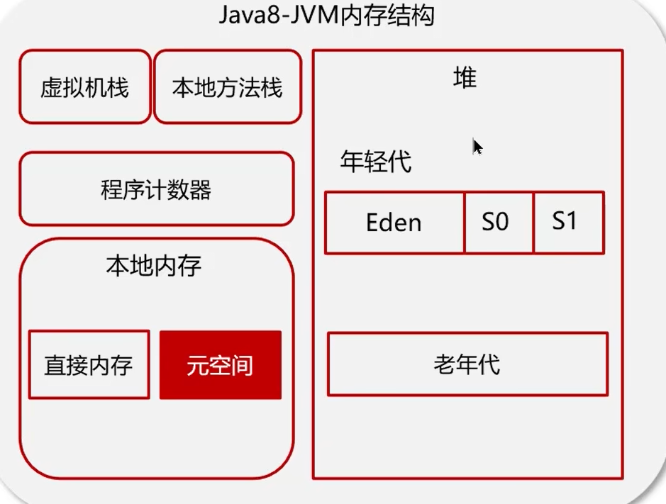
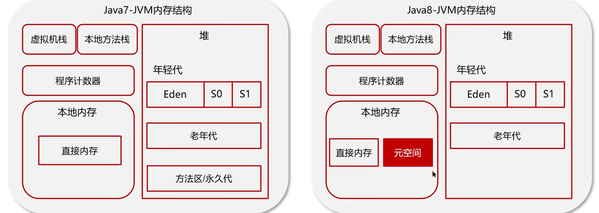

# JVM
## JVM是什么？
Java 虚拟机（Java Virtual Machine，JVM）是运行 Java 字节码的虚拟机。JVM 是 Java 运行环境的一部分，是 Java 的核心和关键所在。
## JVM由哪些部分组成？运行流程是什么？
JVM 主要由类加载器、运行时数据区、执行引擎、本地方法接口和本地方法库等组成
1.java源文件编译成.class文件
2.类加载器加载.class文件
3.类加载器将.class文件加载到运行时数据区
4.执行引擎执行.class文件
5.本地方法接口调用本地方法库
## 什么是程序计数器？
程序计数器是一块较小的内存空间，是线程私有的，用来存储当前线程正在执行的字节码指令的地址。

## Java堆
1. 线程共享区域：用来保存对象实例和数组，是垃圾回收器管理的主要区域
* 年轻代和老年代
* 新生代：Eden区、Survivor区
* 老年代：存放长期存活的对象

* 元空间保存的类信息、静态变量、常量、编译后的代码。

* 1.7 有永久代，1.8 有元空间

## 什么是栈？
1. 每个线程运行时所需的内存，称为虚拟机栈，栈中存放的是栈帧，对应方法的调用和执行。
2. 每个线程只能有一个活动栈帧，对应当前正在执行的方法。
### 垃圾回收是否涉及栈？
不涉及，栈中存放的是基本数据类型和对象的引用，对象的实例是存放在堆中的。
### 栈内存分配越大越好吗？
默认的栈内存通常为1024k，如果栈内存分配过大，会导致内存浪费，如果栈内存分配过小，会导致栈溢出。
