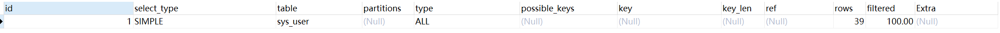

# Mysql
## 如何定位慢查询

::: tip 产生原因
表象：页面加载过慢、接口响应时间过长（超过1s）
1. 聚合查询 2. 多表查询 3.表数据量过大 4. 深度分页查询
:::

### 方案一：开源工具
* 调试工具：Arthas（阿里）
* 运维工具: Prometheus、Skywalking

### 方案二：Mysql自带慢查询日志
1. 开启慢查询日志 <br>
慢查询日志 查询的是超过指定时间的数据（long_query_time） <br>
在 MySQL 的配置文件（通常是 my.cnf 或 my.ini）中，添加或修改以下配置项：
```shell
[mysqld]
slow_query_log = 1              # 开启慢查询日志 1 表示开启慢查询日志，0 表示关闭。
slow_query_log_file = /path/to/slow_query.log  # 慢查询日志文件路径
long_query_time = 2             # 设置慢查询的阈值（单位为秒，默认10秒）
log_queries_not_using_indexes = 1  # 记录未使用索引的查询，1 表示记录，0 表示不记录。
```
## 如何分析执行速度很慢的SQL语句
1. 使用**explain**分析SQL语句
```sql
explain select * from sys_user where id = 1;
```

* possible_keys: 可能使用的索引
* key: 实际使用的索引
* key_len: 索引占用的大小
* Extra: 额外信息

| Extra                   | 含义                              | 
|-------------------------|---------------------------------| 
| Using where;Using Index | 查找使用了索引，需要的数据都在索引列中能找到，不需要回表查询数据| 
| Using index condition   | 查找使用了索引，但需要回表查询数据 |

* type: 查询类型  性能从好到差
    * system > const > eq_ref > ref > range > index > all
    * system: 表只有一行记录（等于系统表）
    * const: 根据主键查询
    * eq_ref: 主键或唯一索引查询
    * ref: 普通索引
    * range: 索引范围扫描
    * index: **索引树扫描**
    * all: **全表扫描**

## 什么是索引

::: tip 索引
索引是帮助MySQL高效获取数据的数据结构，Innodb特定查找算法B+树，以某种方式指向表中的数据。
:::

### 简单说一下B树
B树：多叉路平衡查找树，每一个节点有多个分支，5阶的B树，每个节点最多有4个子节点，最少有2个子节点。
