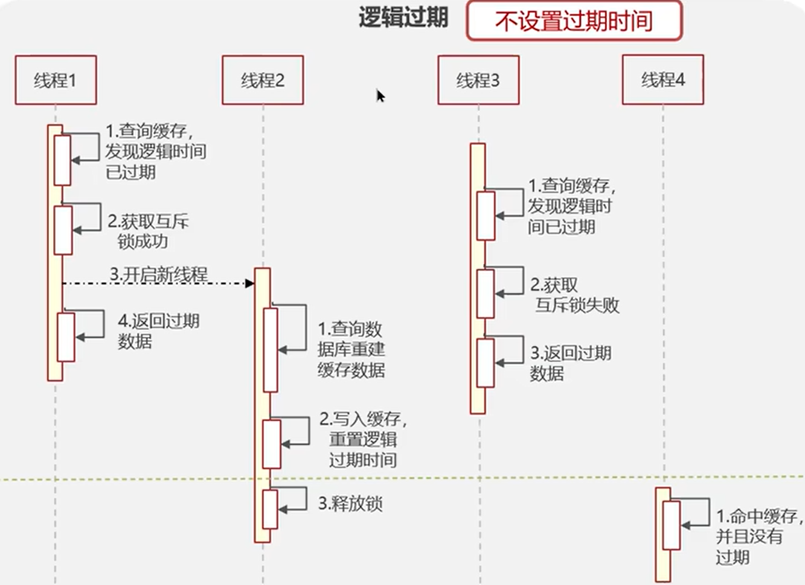
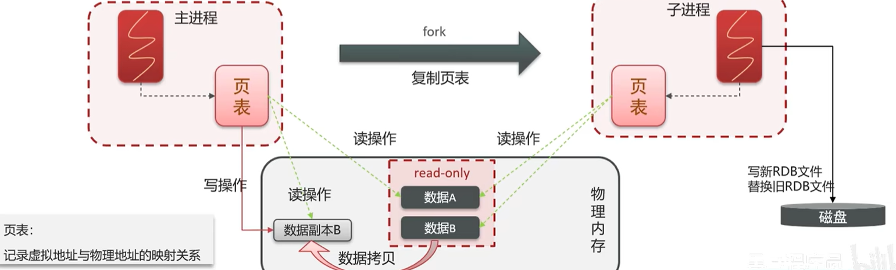

# Redis

## Redis 的使用场景
1. 缓存
2. 分布式锁
3. 消息队列、延迟队列

## 缓存穿透
::: tip 定义
查询一个不存在的数据，MySQL 查询不到数据也不会直接写入缓存，这会导致每次请求都查询数据库。
:::

#### 解决方案
1. **缓存空数据**  
   查询返回的数据为空时，仍将这个空数据写入缓存。  
   优点：可以防止缓存穿透。  
   缺点：缓存空数据可能会占用大量缓存空间。

2. **布隆过滤器**
    - 缓存预热：系统启动时，把所有可能的数据都加载到缓存中。
    - 位图（bitmap）：相当于一个以位为单位的数组，数组中的每个元素只能是 0 或 1，用于判断某个元素是否存在。

   **布隆过滤器用来判断一个元素是否存在于一个集合中。**
    - **存储数据**：将数据通过多个哈希函数映射到位图中的多个位置，并将这些位置的值置为 1。
    - **查询数据**：将数据通过多个哈希函数映射到位图中的多个位置，判断这些位置的值是否都为 1。
    - 可能存在误判：数组越小误判率越高，数组越大误判率越低，但占用内存越大。误判率是可以设置的。


#### 实现方式
- Guava
- Redisson

#### 优缺点
1. 查询速度快 2. 占用内存少 3. 可能存在误判 4. 无法删除数据

## 缓存击穿
::: tip 定义
缓存中的数据过期，大量请求同时查询数据库，导致数据库压力过大。
:::

解决方案:

1. 互斥锁 性能差

2. 逻辑过期 不能保证数据绝对一致


## 缓存雪崩
::: tip 定义
缓存中的数据同时过期，大量请求同时查询数据库，导致数据库压力过大。
:::

解决方案:

1. 给不同的key设置不同的过期时间
2. 利用Redis集群提高服务的高可用性  哨兵模式、集群模式
3. 限流降级 nginx/gateway 保底策略
4. 给业务添加多级缓存 Guava或Caffeine

## 双写一致性
::: tip 定义
缓存和数据库的数据要保持一致。
:::

解决方案:

> 先删除缓存，还是先更新数据库？

延迟双删策略 有可能会出现数据不一致

分布式锁 保证数据一致性

异步更新缓存 保证数据最终一致性  MQ的可靠性或者Canal中间件读取binlog  可以接收短暂延迟

## redis持久化
::: tip 定义
Redis 持久化是指将 Redis 在内存中的数据保存到硬盘中，以便在 Redis 重启后可以再次加载使用。
:::

### RDB 持久化
RDB 持久化是通过快照的方式来进行持久化的，当满足一定条件时，Redis 会自动将内存中的数据保存到硬盘中。
```shell
save 900 1 # 900 秒内有 1 个 key 发生变化
bgsave # 异步保存
```
#### 执行原理
1. Redis 会 fork 出一个子进程，子进程负责将内存数据写入到临时文件中。
2. 页表: 内存中的数据是通过页表来管理的，子进程会复制一份父进程的页表，这样就可以保证子进程可以访问到父进程的所有数据。
   

### AOF 持久化
AOF 持久化是通过记录 Redis 服务器所处理的每一个写操作来记录数据库的变化。
```shell
appendonly yes
appendfsync always # 每次写入都同步
appendfsync everysec # 每秒同步
appendfsync no # 不同步
bgrewriteaof # 重写AOF文件 最少的命令达到相同的效果
```
redis.conf 配置文件
```shell
appendonly yes
appendfsync everysec
auto-aof-rewrite-percentage 100 # 当AOF文件大小超过上次重写后的大小100%时，触发重写
auto-aof-rewrite-min-size 64mb # AOF文件大小超过64M时，触发重写
```
实际工作都是使用 RDB 和 AOF 混合使用，先读取 AOF 文件，再读取 RDB 文件。

## Redis数据过期策略

> 假如redis的key过期之后，会立即删除吗？

### 惰性删除

当客户端访问某个 key 时，Redis 会检查这个 key 是否过期，如果过期则删除。

对内存不是很友好，可能会导致内存泄漏。

### 定期删除

Redis 默认每隔 100ms 就随机抽取一些 key 进行检查，如果过期则删除。

难以确定删除操作执行的时常和频率。

Redis 的过期键删除策略是惰性删除和定期删除的结合。

## Redis的数据淘汰策略

> 当 Redis 的内存不足时，会如何处理？

LRU（Least Recently Used）：最近最少使用

LFU（Least Frequently Used）：最少频率使用

8种数据淘汰策略：
* noeviction：默认策略，不会删除任何数据，直接返回错误。
* volatile-lru：从设置了过期时间的数据集中删除最近最少使用的数据。
* allkeys-random：从所有数据集中随机删除数据。
* volatile-random：从设置了过期时间的数据集中随机删除数据。
* volatile-ttl：从设置了过期时间的数据集中删除最快要过期的数据。
* allkeys-lru：从所有数据集中删除最近最少使用的数据。
* allkeys-lfu：从所有数据集中删除最不经常使用的数据。
* volatile-lfu：从设置了过期时间的数据集中删除最不经常使用的数据。

1. 优先使用 allkeys-lru策略，如果有冷热数据区分
2. 优先使用 allkeys-random策略，如果没有冷热数据区分
3. 优先使用 volatile-lru策略，如果有置顶不设置过期时间的热数据
4. 优先使用 allkeys-lfu/volatile-lfu 策略，如果短时间高频访问

> 1.数据库有1000万数据，Redis只能缓存20万数据，如何保证热点数据都在内存中？

使用allkeys-lru策略，将热点数据放在内存中。

> 2.redis的内存用完了会发生什么？

1. 内存淘汰策略

## Redis实现分布式锁

使用场景:
1. 需要结合项目中的业务进行回答，通常情况下，分布式锁用于解决并发问题。
* 集群下的定时任务、抢单、幂等性场景。

### 使用原理

1. setnx(key, value)：如果 key 不存在，则设置 key 的值为 value，返回 1；如果 key 存在，则返回 0。

```xml
# 1. 加锁 NX 互斥 EX 过期时间
SET KEY value NX EX 10
# 2. 解锁
DEL KEY
```

> redis分布式锁如何合理控制锁的有效时长？

1. 业务执行时间不确定，锁的有效时长应该大于业务执行时间。
2. 锁续期

### redission实现的分布式锁
1. 加锁后 每隔一段时间续期 (releaseTime - currentTime) / 3 每隔10秒续期一次
2. while循环不断尝试获取锁，直到获取锁成功或者超时 重试机制
3. 加锁和设置过期时间都是基于Lua脚本实现的，保证原子性
4. redisson实现的分布式锁是可重入锁 跟当前的线程绑定 必须是同一个线程才能重入
5. 利用hash结构 线程id和冲入次数
6. 红锁： 不能只能一个节点加锁，需要多个节点加锁，（n/2）+ 1个节点加锁成功，才算成功 不能保证主从一致性
7. redis 保证ap 高可用  Zookeeper 保证cp 高一致性
