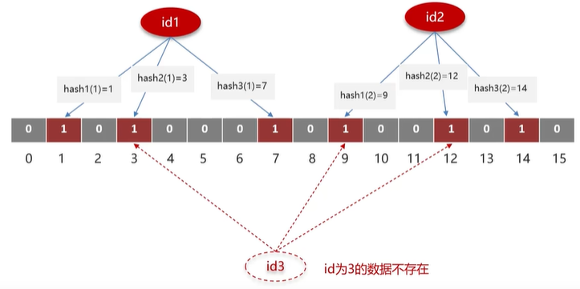

# Redis

## Redis 的使用场景
1. 缓存
2. 分布式锁
3. 消息队列、延迟队列

## 缓存穿透
::: tip 定义
查询一个不存在的数据，MySQL 查询不到数据也不会直接写入缓存，这会导致每次请求都查询数据库。
:::

#### 解决方案
1. **缓存空数据**  
   查询返回的数据为空时，仍将这个空数据写入缓存。  
   优点：可以防止缓存穿透。  
   缺点：缓存空数据可能会占用大量缓存空间。

2. **布隆过滤器**
    - 缓存预热：系统启动时，把所有可能的数据都加载到缓存中。
    - 位图（bitmap）：相当于一个以位为单位的数组，数组中的每个元素只能是 0 或 1，用于判断某个元素是否存在。

   **布隆过滤器用来判断一个元素是否存在于一个集合中。**
    - **存储数据**：将数据通过多个哈希函数映射到位图中的多个位置，并将这些位置的值置为 1。
    - **查询数据**：将数据通过多个哈希函数映射到位图中的多个位置，判断这些位置的值是否都为 1。
    - 可能存在误判：数组越小误判率越高，数组越大误判率越低，但占用内存越大。误判率是可以设置的。

#### 实现方式
- Guava
- Redisson

#### 优缺点
1. 查询速度快 2. 占用内存少 3. 可能存在误判 4. 无法删除数据
