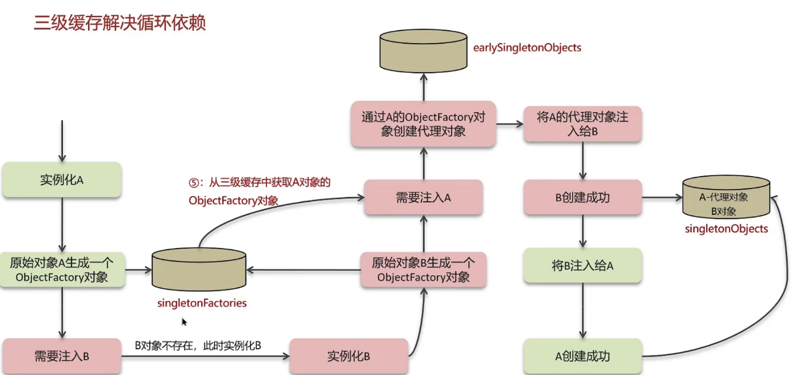

# Spring
## Spring中的单例Bean是线程安全的吗？
* singleton Bean 是线程安全的，因为 Spring 容器会保证在同一个容器中，一个 Bean 只有一个实例。
* prototype Bean 是非线程安全的，因为每次获取 Prototype Bean 时，Spring 都会创建一个新的实例。
```java
@Scope("singleton") // 默认是单例
```
解答：
<span style="color:#E8323C;">只是某种程度上线程安全<span> <br> 

**不是线程安全的**，因为单例 Bean 的属性是共享的，如果多个线程同时访问一个单例 Bean 的属性，可能会出现线程安全问题。**可以通过加锁/多实例解决**。

## 什么是AOP？
AOP（Aspect Oriented Programming）面向切面编程，用于将与业务无关，但却对多个对象产生影响的公共行为封装到一个独立的模块中，这些公共行为成为切面（Aspect），减少重复代码，提高代码的复用性。

1. 对方法的增强，不需要修改原有的代码，只需要在需要增强的方法上添加一个切面，即可实现增强。

可以通过 AOP 实现的功能：
* 日志记录
* 事务处理

## Spring中的事务是如何实现的？
Spring 事务的实现是基于 AOP 的，通过 AOP 实现事务管理，Spring 提供了两种事务管理方式：
1. 编程式事务管理 

通过 TransactionTemplate实现编程式事务管理，对业务代码进行事务管理。
```java
TransactionTemplate transactionTemplate = new TransactionTemplate(transactionManager);  
transactionTemplate.execute(new TransactionCallbackWithoutResult() {  
    @Override  
    protected void doInTransactionWithoutResult(TransactionStatus status) {  
        // 业务代码  
    }  
});
```
2. 声明式事务管理 本质是 AOP 通过代理对象实现的

通过 @Transactional 注解实现声明式事务管理，对业务方法进行事务管理。
```java
@Transactional
public void insertUser(User user) {
    // 业务代码
}
```
## Spring中的事务失效场景有哪些？
1. 异常被捕获  事务默认只在抛出运行时异常时回滚，如果异常被捕获，事务将不会回滚。
2. 抛出检查异常  事务默认只在抛出运行时异常时回滚，如果抛出检查异常，事务将不会回滚。（加上 rollbackFor = Exception.class 可以回滚）
3. 非public方法导致事务失效  Spring 事务是通过 AOP 实现的，只能对 public 方法进行事务管理，非 public 方法事务失效。

## BeanDefinition是什么？
> Spring容器在进行实例化时，会将xml配置的<bean>的信息封装成BeanDefinition对象，BeanDefinition对象是对bean配置信息的封装，包括bean的类名、属性、构造方法、初始化方法、销毁方法等。

* beanClassName：bean的类名
* scope：bean的作用域
* lazyInit：是否懒加载
* initMethodName：初始化方法
* propertyValues：属性值


## Spring的Bean的初始化过程是怎样的？

1. 构造函数 BeanDefinition
2. 依赖注入 
3. Aware接口回调 
4. BeanPostProcessor的前置处理
5. 初始化方法 InitializingBean 自定义初始化方法
6. BeanPostProcessor的后置处理 AOP

总结：Bean的初始化过程是在Bean的实例化之后，初始化之前，通过BeanPostProcessor的前置处理和后置处理来实现的。

## 什么是Spring的循环依赖？
> Spring容器在实例化Bean时，如果A依赖B，B依赖A，就会产生循环依赖。

Spring解决循环依赖的方式：三级缓存

1. 一级缓存 singletonObjects：存放完全初始化的Bean
2. 二级缓存 earlySingletonObjects：存放原始的Bean
3. 三级缓存 singletonFactories：存放Bean的工厂



### 构造方法出现循环依赖
```java
public class A {
    private B b;
    public A(B b) {
        this.b = b;
    }
}
public class B {
    private A a;
    public B(A a) {
        this.a = a;
    }
}
```
解决方式：通过**@Lazy**注解实现懒加载，什么时候需要Bean时再去创建Bean。

## SpringMVC的执行流程是怎样的？


1. 用户发送请求到前端控制器 DispatcherServlet
2. DispatcherServlet 根据请求信息调用 HandlerMapping（处理映射器）
3. HandlerMapping找到具体的处理器，生成处理器对象及处理器拦截器一并返回给 DispatcherServlet
4. DispatcherServlet 调用 HandlerAdapter （处理器适配器）
5. HandlerAdapter 经过适配调用具体的处理器(Controller，也叫后端控制器)
6. Controller 执行完成返回 ModelAndView
7. 处理器适配器将 Controller 执行结果 ModelAndView 返回给 DispatcherServlet
8. DispatcherServlet 将 ModelAndView 传给 ViewReslover 视图解析器
9. 视图解析器解析后返回具体 View
10. DispatcherServlet 对 View 进行渲染视图（即将模型数据填充至视图中）
11. DispatcherServlet 响应用户

## SpringBoot自动装配原理是什么？
SpringBoot的自动装配是通过 @EnableAutoConfiguration 注解实现的，@EnableAutoConfiguration 注解是 SpringBoot 的核心注解之一，用于开启自动配置功能。
* @EnableAutoConfiguration 该注解通过@Import注解导入对应的配置选择器。
* 内部就是读取META-INF/spring.factories文件。
* 根据条件注解例如@ConditionalOnClass来判断是否是否有对应的class文件，如果有则自动配置。

## Spring的常见注解
1. `@Component`、`@Service`、`@Controller`、`@Repository`：用于标注Bean
2. `@Autowired`：自动装配
3. `@Qualiifer`：根据名称进行依赖注入
4. `@Scope`：设置Bean的作用域
5. `@Configration`：配置类
6. `@Bean`：定义Bean
7. `@ComponentScan`：扫描包
8. `@Import`：使用@Import导入的类会被Spring容器托管
9. `@Aspect`、`@Pointcut`、`@Before`、`@After`、`@Around`：用于切面编程

## SpringMVC的常见注解
1. `@RequestMapping`：用于映射请求路径，可以定义在类上或方法上
2. `@RequestBody`：注解实现接收http请求的json数据，将json数据转换为对象
3. `@ResponseBody`：注解实现将controller方法返回的对象转为json格式
4. `@PathVariable`：用于接收路径参数
5. `@RequestParam`：用于接收请求参数
6. `@RequestHeader`：用于接收请求头信息
7. `@RestController`：相当于@Controller和@ResponseBody的结合

## SpringBoot的常见注解
1. `@SpringBootApplication`：SpringBoot的核心注解，用于开启自动配置
2. `@EnableAutoConfiguration`：开启自动配置
3. `@ComponentScan`：扫描包
