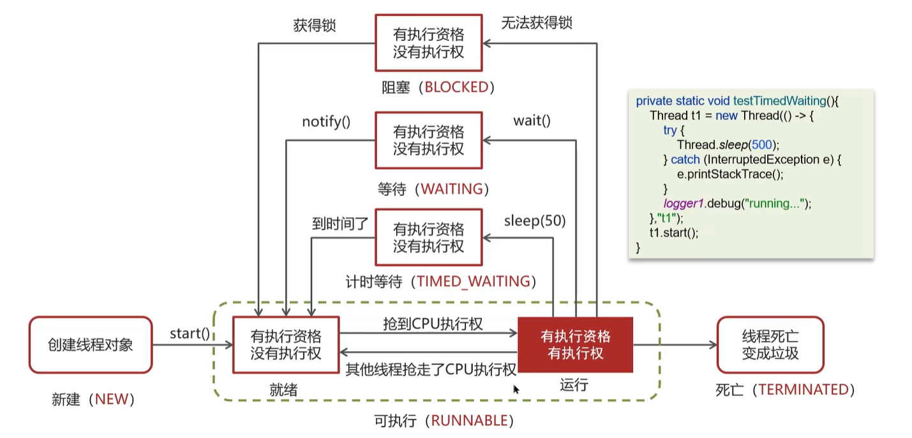
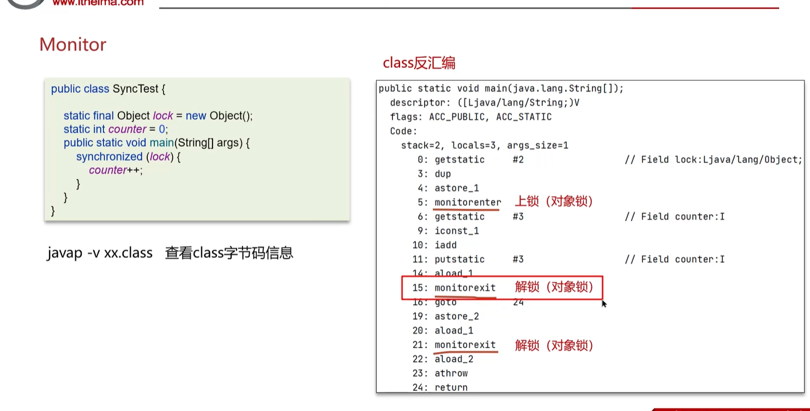
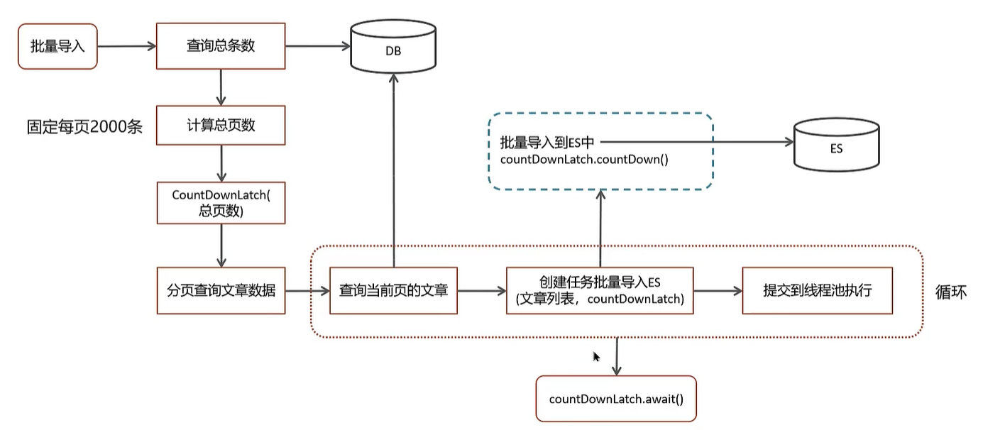

# 多线程
## 进程和线程的区别
* 程序由指令和数据组成，进程是程序的一次执行，线程是进程的一个执行流程。
* 当一个程序被运行，从磁盘加载程序的代码到内存，这时就开启了一个进程。
* 一个线程就是一个指令流，将指令流中的一条条指令以一定的顺序交给CPU执行。
* 一个进程里面分为一到多个线程。
### 区别
1. 进程包含线程
2. 不同的进程使用不同的内存空间，线程共享进程的内存空间
3. 线程更加轻量级，创建和销毁线程的开销比进程小

## 并行和并发的区别
* 并行：多个任务同时执行
* 并发：多个任务交替执行
1. 单核cpu下线程实际是并发执行的，多核cpu下线程才是并行执行的。
2. 并发：同一时间应对多件事情的能力
3. 并行：同一时间做多件事情的能力

## 创建线程的方式有哪些
1. 继承Thread类
```java
public class MyThread extends Thread {
    @Override
    public void run() {
        System.out.println("MyThread");
    }
}
```
2. 实现Runnable接口
```java
public class MyRunnable implements Runnable {
    @Override
    public void run() {
        System.out.println("MyRunnable");
    }
}
```
3. 实现Callable接口
```java
public class MyCallable implements Callable<String> {
    @Override
    public String call() throws Exception {
   
        return "MyCallable";
    }
}
```
4. 使用线程池
```java
ExecutorService executorService = Executors.newFixedThreadPool(10);// 创建一个固定大小的线程池
executorService.execute(new MyRunnable());// 执行Runnable
Future<String> future = executorService.submit(new MyCallable());// 执行Callable
```
## runnable和callable的区别
1. Runnable的run方法没有返回值，Callable的call有返回值
2. Runnable的run方法不能抛出异常，Callable的call方法可以抛出异常

## 线程包含哪些状态，状态之间是如何变化的
1. NEW：新建状态
2. RUNNABLE：可运行状态
3. BLOCKED：阻塞状态
4. WAITING：等待状态
5. TIMED_WAITING：超时等待状态
6. TERMINATED：终止状态
* 线程的状态之间是如何变化的


* 创建线程对象是新建状态
* 调用了start()方法后，线程进入可运行状态
* 线程获取了cpu的执行权，执行结束是终止状态
* 在可执行状态的过程中，如果没有获取cpu的执行权，可能会切换其他状态

## 新建T1、T2、T3三个线程，如何保证T2在T1执行完后执行，T3在T2执行完后执行
1. 可以使用线程中的join方法解决
```java
public class JoinTest {
    public static void main(String[] args) {
        Thread t1 = new Thread(() -> {
            System.out.println("T1");
        });
        Thread t2 = new Thread(() -> {
            try {
                t1.join();
            } catch (InterruptedException e) {
                e.printStackTrace();
            }
            System.out.println("T2");
        });
        Thread t3 = new Thread(() -> {
            try {
                t2.join();
            } catch (InterruptedException e) {
                e.printStackTrace();
            }
            System.out.println("T3");
        });
        t1.start();
        t2.start();
        t3.start();
    }
}
``` 
## notify和notifyAll的区别
1. notify：唤醒一个等待线程
2. notifyAll：唤醒所有等待线程

## wait和sleep的区别
### 共同点
1. wait和sleep都可以进入阻塞状态
2. 都可以被打断唤醒
### 不同点
* sleep是Thread类的静态方法，wait是Object类的方法
* sleep不会释放锁，wait会释放锁
* sleep必须指定时间，wait可以指定时间也可以不指定时间
* wait必须在同步代码块中使用，sleep可以在任何地方使用

## 如何停止正在运行的线程
* 使用退出标志
```java
public class StopThread {
    private static volatile boolean flag = true;
    public static void main(String[] args) {
        Thread thread = new Thread(() -> {
            while (flag) {
                System.out.println("running");
            }
        });
        thread.start();
        try {
            Thread.sleep(1000);
        } catch (InterruptedException e) {
            e.printStackTrace();
        }
        flag = false;
    }
}
```
* 使用interrupt方法
```java
public class StopThread {
    public static void main(String[] args) {
        Thread thread = new Thread(() -> {
            while (!Thread.currentThread().isInterrupted()) {
                System.out.println("running");
            }
        });
        thread.start();
        try {
            Thread.sleep(1000);
        } catch (InterruptedException e) {
            e.printStackTrace();
        }
        thread.interrupt();
        // 阻塞的线程会抛出InterruptedException异常
    }
}
```
* 使用stop方法（不推荐）
```java
public class StopThread {
    public static void main(String[] args) {
        Thread thread = new Thread(() -> {
            while (true) {
                System.out.println("running");
            }
        });
        thread.start();
        try {
            Thread.sleep(1000);
        } catch (InterruptedException e) {
            e.printStackTrace();
        }
        thread.stop();
    }
}
```
## synchronized关键字的底层原理 悲观锁
* Monitor

1. 每个对象都有一个Monitor对象，Monitor对象是由C++实现的
2. Monitor对象里面有一个Owner字段，记录当前拥有锁的线程，为null表示没有线程拥有锁
3. Monitor对象里面有一个EntryList字段，记录等待锁的线程
4. Monitor对象里面有一个WaitSet字段，记录调用了wait方法的线程
* Monitor 是重量级锁，会消耗系统资源，JVM会尽量减少Monitor的使用

## 谈谈JMM
* JMM（Java Memory Model）是一种规范，定义了Java虚拟机和计算机硬件之间的工作协议
* 共享内存中多线程程序读写操作的行为规范
* 工作内存和主内存，线程和线程之间是相互隔离的，交互需要通过主内存来完成。

## CAS 乐观锁
* CAS（Compare And Swap）是一种乐观锁技朽，通过比较当前值和期望值是否一样，一样则更新，不一样则不更新
* 因为没有加锁，所以线程不会陷入阻塞，效率较高。
* 如何竞争激烈，重试频繁发生，效率会受影响。
* 底层依赖于unsafe类来直接调用操作系统底层的CAS指令
* ReentrantLock、AtomicInteger等类都是基于CAS实现的

## 谈谈你对volatile的理解
* 一旦一个共享变量被volatile修饰
1. 保证了线程之间的可见性 读取的都是主内存
2. 禁止指令重排序 写共享变量时加入不同的屏障，阻止其他读写操作越过屏障，从而达到禁止指令重排序的目的

## 什么是AQS
* AQS（AbstractQueuedSynchronizer）是JUC包中的一个工具类，是用来构建锁和同步器的基础框架
* 抽象队列同步器，是一个用来构建锁和同步器的框架，ReentrantLock、CountDownLatch、Semaphore、ReentrantReadWriteLock等都是基于AQS实现的
### AQS和synchronized的区别
1. synchronized是关键字，AQS是一个工具类
2. synchronized是悲观锁，AQS是乐观锁
3. synchronized只能实现互斥锁，AQS可以实现互斥锁和读写锁

### 工作机制
1. AQS维护了一个volatile int state，表示当前同步状态
2. AQS维护了一个FIFO队列，用于存放等待获取锁的线程
3. AQS定义了两种资源共享方式，独占和共享

### 多线程共同去抢资源是如何保证原子性？
* 通过CAS操作保证原子性
* 可以是公平锁，也可以是非公平锁

## ReentrantLock的实现原理
* ReentrantLock是基于AQS实现的
* 可中断
* 可以设置超时时间
* 可以设置公平锁
* 支持多个条件变量
* 与synchronized一样，都支持重入
主要是利用CAS和A队列来实现的，默认非公平锁，可以通过构造方法设置为公平锁。

## synchronized和 Lock的区别
1. synchronized是关键字，Lock是一个接口
2. synchronized和Lock都是悲观锁，具备互斥、同步、锁重入的功能
3. synchronized 退出同步块时会自动释放锁，Lock需要手动释放锁
4. Lock提供了许多syncrhonized不具备的特性，如可中断、超时、公平锁等

## 产生死锁的条件
1. 互斥条件：一个资源每次只能被一个进程使用
2. 请求与保持条件：一个进程因请求资源而阻塞时，对已获得的资源保持不放
3. 不剥夺条件：进程已获得的资源，在未使用完之前，不能强行剥夺
4. 循环等待条件：若干进程之间形成一种头尾相接的循环等待资源关系
## 如何进行死锁诊断？
1. jps查看进程号
2. jstack 进程号 查看线程堆栈信息
```xml
jps 查看进程号
jstack -l 进程号
```
### 可视化工具
* jconsole是JDK自带的监控工具，可以查看线程、内存、类、MBean等信息
* VisualVM是一个免费的开源工具，可以查看线程、内存、类、GC、CPU等信息

## ConcurrentHashMap
* ConcurrentHashMap是一个线程安全的哈希表，是HashMap的线程安全版本
* JDK1.7采用分段锁实现，JDK1.8采用CAS和synchronized实现
* 分段锁：将整个哈希表分为N个Segment，每个Segment都是一个小的哈希表，每个Segment都有自己的锁，只要保证每个Segment是线程安全的，就可以保证整个ConcurrentHashMap是线程安全的
* JDK1.8采用CAS和synchronized实现，将整个哈希表分为N个桶，每个桶是一个链表，当链表长度大于8时，链表转换为红黑树，提高查询效率
* CAS 控制数组节点的添加
* synchronized 控制链表的添加

## 导致并发程序出现问题的根本原因是什么？
* 原子性 一个或多个操作要么全部执行成功，要么全部执行失败
* 可见性 让一个线程对共享变量的修改，对其他线程是立即可见的
* 有序性 保证程序执行的顺序按照代码的先后顺序执行

## 线程池的核心参数
1. corePoolSize 核心线程数
2. maximumPoolSize 最大线程数 = 核心线程数 + 救急线程数
3. keepAliveTime 线程空闲时间
4. unit 时间单位
5. workQueue 阻塞队列
6. threadFactory 线程工厂
7. handler 拒绝策略
### 拒绝策略
1. AbortPolicy 直接抛出异常
2. CallerRunsPolicy 由调用线程处理
3. DiscardPolicy 直接丢弃任务
4. DiscardOldestPolicy 丢弃队列中最老的任务

## 线程池有哪些常见的阻塞队列
1. ArrayBlockingQueue 基于数组的有界队列
2. LinkedBlockingQueue 基于链表的有界队列 默认无界
3. DelayedWorkQueue 是一个优先级队列
4. SynchronousQueue 不存储元素的队列

## 如何确定核心线程数
1. IO密集型 2N+1 文件读写、网络读写、DB读写
2. CPU密集型 N+1 计算型代码、Bitmap、Gson转换

## 线程池的种类
1. newFixedThreadPool 固定大小线程池 适用于任务量已知，相对耗时的任务。
2. newSingleThreadExecutor 单线程线程池 适用于按照顺序执行任务
3. newCachedThreadPool 缓存线程池 适用于任务量比较密集，任务执行时间短的任务
4. newScheduledThreadPool 定时线程池 适用于需要定时执行任务的场景

## 为什么不建议使用Executors创建线程池
1. newFixedThreadPool 和 newSingleThreadExecutor 使用的是无界队列，可能会导致OOM
2. newCachedThreadPool 使用的是SynchronousQueue，可能会导致线程数过多，导致OOM

## 线程池的使用场景
1. CountDownLatch 用于等待多个线程执行完毕
* 初始化CountDownLatch时，需要传入一个int类型的参数，表示计数器的初始值
* 调用CountDownLatch的countDown方法时，计数器减1
* 调用CountDownLatch的await方法时，会阻塞当前线程，直到计数器的值为0
### ES批量导入数据

### 代码实现
```java
public class CountDownLatchDemo {
    public static void main(String[] args) {
        CountDownLatch countDownLatch = new CountDownLatch(5);
        for (int i = 0; i < 5; i++) {
            new Thread(() -> {
                System.out.println(Thread.currentThread().getName() + " 执行完毕");
                countDownLatch.countDown();
            }, String.valueOf(i)).start();
        }
        try {
            countDownLatch.await();
        } catch (InterruptedException e) {
            e.printStackTrace();
        }
        System.out.println("所有线程执行完毕");
    }
}
```
### 数据汇总
* 在实际开发的过程中，难免需要调用多个接口，然后将多个接口的数据汇总到一起，可以使用线程池和Future来实现

### 异步调用
@Async注解可以实现异步调用，可以加在方法上，也可以加在类上，里面指定线程池的名称，启动类上需要加@EnableAsync注解
```java
@Async("asyncServiceExecutor")
public void async() {
    System.out.println("异步调用");
}
```

## 如何控制某个方法的并发数
* Semaphore 信号量，可以控制某个方法的并发数，常用于限流
* Semaphore的构造方法需要传入一个int类型的参数，表示许可的数量
* 调用Semaphore的acquire方法时，会获取一个许可，如果没有许可，会阻塞当前线程
* 调用Semaphore的release方法时，会释放一个许可
### 代码实现
```java
public class SemaphoreDemo {
    public static void main(String[] args) {
        Semaphore semaphore = new Semaphore(3);
        for (int i = 0; i < 10; i++) {
            new Thread(() -> {
                try {
                    semaphore.acquire();
                    System.out.println(Thread.currentThread().getName() + " 执行完毕");
                    Thread.sleep(2000);
                    semaphore.release();
                } catch (InterruptedException e) {
                    e.printStackTrace();
                }
            }, String.valueOf(i)).start();
        }
    }
}
```
## ThreadLocal的理解
* ThreadLocal是一个线程内部的数据存储类，可以在每个线程中存储数据，数据存储在ThreadLocalMap中
可以通过ThreadLocal的get方法获取数据，通过set方法设置数据，通过remove方法移除数据
* 本质来说是一个线程内部存储类，可以让多个线程只操作自己内部的值，从而实现线程数据隔离
* ThreadLocal的使用场景：数据库连接、Session管理、事务管理、日志管理
### 内存泄露问题
1. 强引用 new
2. 弱引用 WeakReference 发生垃圾回收
3. 软引用 SoftReference
4. 虚引用 PhantomReference
* key是弱引用，value是强引用  key被回收，value不会被回收
* 务必使用remove方法，防止内存泄露
